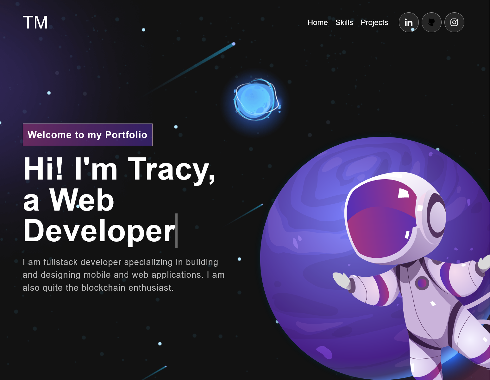

## Portfolio

> This is my professional portfolio as a web developer. It displays the projects I worked on and my skill stack. I got inspiration from [Judy Gab](https://github.com/judygab), from her [Personal portfolio project](https://github.com/judygab/web-dev-projects/tree/main/personal-portfolio). 

## Built With

- HTML & CSS
- Javascript
- React

## Live Demo Link 

- To see the live demo, click [here](https://tracy-muson.netlify.app/)

## Getting Started

**To get a local copy up and running follow these simple example steps.**

# Prerequisites

- Github flow knowledge. -Intermediate CSS, HTML and Javascript. -Installation of linter files. -install webpack

# Setup 
- To get a local copy follow these simple steps:

- Clone Your Github Repository Follow these steps to clone your Clone Your Github Repository Follow these steps to clone my Github repo on Windows:

   - Open Git Bash;

   - If Git is not already installed, it is super simple. Just go to the Git Download Folder and follow the instructions.

   - Go to the current directory where you want the cloned directory to be added;

   - To do this, input cd and add your folder location. You can add the folder location by dragging the folder to Git bash.
    $ cd '/c/Users/Documents/My Git Project'

    - Go to the page of the repository that you want to clone.

    - Click on “Clone or download” and copy the URL.

    - Use the git clone command along with the copied URL from earlier;

    - $ git clone https://github.com/elfin-git/Sturdy-Portfolio

   - Press Enter;

# Tests and Configuration

To track linter errors locally follow these steps:

Download all the dependencies run:

<code>
npm install
</code>

**Track HTML linter errors run:**

<code>
npx hint .
</code>

**Track CSS linter errors run:**
<code>
npx stylelint "**/*.{css,scss}"
</code>

**Track JavaScript linter errors run:**

<code>
npx eslint .
</code>

# Usage
- This can be used as a personal/professional portfolio, it is opensource. One can check out all my projects and skills.

# Install
- Set up Github Actions
- Set up linter > Lighthouse , Webhint ,Stylelint , Eslint.
- React
- Jest for  testing

## Author

👤 **Tracy Musongole**

- GitHub: [@githubhandle](https://github.com/elfin-git)
- Twitter: [@twitterhandle](https://twitter.com/tracy_muso)
- LinkedIn: [@LinkedIn](https://linkedin.com/in/tracy-muso/)

## 🤝 Contributing
Contributions, issues, and feature requests are welcome!

Feel free to check the [issues page](https://github.com/elfin-git/Sturdy-Portfolio/issues).

## Show your support

Give a ⭐️ if you like this project!

## Acknowledgments

- Hat tip to anyone whose code was used
- Inspiration
- etc

## 📝 License

This project is [MIT](https://github.com/elfin-git/Sturdy-Portfolio/blob/dev/LICENSE) licensed.
